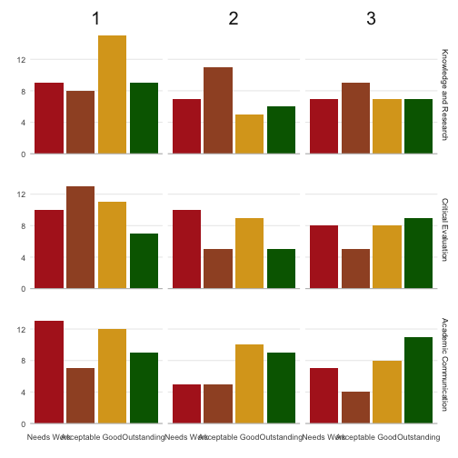

# markr 

<!-- rmarkdown v1 -->
<!-- README.md is generated from README.Rmd. Please edit that file -->


<!-- badges: start -->
[](https://www.tidyverse.org/lifecycle/#experimental)
<!-- badges: end -->

The goal of markr is to create individual feedback documents and marking summaries from flexibly organised spreadsheets and other types of input.

## Installation

You can install the released version of markr from GitHub with:

``` r
remotes::install_github("psyteachr/markr")
```

## Quick Start

Run the following code to create an `example` directory and then explore the code in `demo.Rmd`.


```r
markr::markr_example()
```


## Example

Your marking file might be organised like this, with a column for the student ID, three columns for category marks (KR, CE and AC), a column for the numeric mark, and a column with individual text feedback. 


```r
data("demo_marks", package = "markr")
```

<table>
 <thead>
  <tr>
   <th style="text-align:left;"> ID </th>
   <th style="text-align:left;"> name </th>
   <th style="text-align:left;"> marker </th>
   <th style="text-align:left;"> question </th>
   <th style="text-align:right;"> KR </th>
   <th style="text-align:right;"> CE </th>
   <th style="text-align:right;"> AC </th>
   <th style="text-align:right;"> mark </th>
   <th style="text-align:left;"> feedback </th>
  </tr>
 </thead>
<tbody>
  <tr>
   <td style="text-align:left;"> S1 </td>
   <td style="text-align:left;"> Mukul </td>
   <td style="text-align:left;"> Prof. X </td>
   <td style="text-align:left;"> A </td>
   <td style="text-align:right;"> 4 </td>
   <td style="text-align:right;"> 4 </td>
   <td style="text-align:right;"> 4 </td>
   <td style="text-align:right;"> 4 </td>
   <td style="text-align:left;"> Lorem ipsum... </td>
  </tr>
  <tr>
   <td style="text-align:left;"> S2 </td>
   <td style="text-align:left;"> Kias </td>
   <td style="text-align:left;"> Prof. X </td>
   <td style="text-align:left;"> B </td>
   <td style="text-align:right;"> 4 </td>
   <td style="text-align:right;"> 3 </td>
   <td style="text-align:right;"> 2 </td>
   <td style="text-align:right;"> 3 </td>
   <td style="text-align:left;"> Lorem ipsum... </td>
  </tr>
  <tr>
   <td style="text-align:left;"> S3 </td>
   <td style="text-align:left;"> Omair </td>
   <td style="text-align:left;"> Prof. X </td>
   <td style="text-align:left;"> B </td>
   <td style="text-align:right;"> 4 </td>
   <td style="text-align:right;"> 4 </td>
   <td style="text-align:right;"> 4 </td>
   <td style="text-align:right;"> 4 </td>
   <td style="text-align:left;"> Lorem ipsum... </td>
  </tr>
  <tr>
   <td style="text-align:left;"> S4 </td>
   <td style="text-align:left;"> Ramesha </td>
   <td style="text-align:left;"> Prof. X </td>
   <td style="text-align:left;"> A </td>
   <td style="text-align:right;"> 1 </td>
   <td style="text-align:right;"> 2 </td>
   <td style="text-align:right;"> 2 </td>
   <td style="text-align:right;"> 1 </td>
   <td style="text-align:left;"> Lorem ipsum... </td>
  </tr>
  <tr>
   <td style="text-align:left;"> S5 </td>
   <td style="text-align:left;"> Libby-Marie </td>
   <td style="text-align:left;"> Prof. X </td>
   <td style="text-align:left;"> A </td>
   <td style="text-align:right;"> 2 </td>
   <td style="text-align:right;"> 3 </td>
   <td style="text-align:right;"> 3 </td>
   <td style="text-align:right;"> 2 </td>
   <td style="text-align:left;"> Lorem ipsum... </td>
  </tr>
</tbody>
</table>


Markr has a convenience function for translating between number and letter grades for different purposes. It defaults to the `glasgow22()` scale, but you can add your own scale.


```r
scale <- data.frame(
  numbers = 4:0,
  letters = c("A", "B", "C", "D", "E")
)
demo_marks$grade <- convert_grades(demo_marks$mark, to = "letters", scale)

select(demo_marks, mark, grade)
#>   mark grade
#> 1    4     A
#> 2    3     B
#> 3    4     A
#> 4    1     D
#> 5    2     C
```


### Feedback Template 

You will need to create a template Rmd file for individual feedback. You can get a demo template using **`New File > R Markdown... > From Template`**.

Each file will have two data objects available to it: 

* `marks` (the whole marking spreadsheet) 
* `ind` (the individual student's data)

In the most typical case, where each student has one row in the spreadsheet, you can reference the student's data in code blocks or inline R like this:

<pre>
---  
title: "Feedback"  
date: "&grave;r format(Sys.time(), '%d %B, %Y')&grave;"  
output: html_document  
---

**Student**: &grave;r ind$name&grave;  
**Marker**: &grave;r ind$marker&grave;  
**Grade**: &grave;r ind$grade&grave;

</pre>

### Category Tables


You can display a table of marks for specific criteria by specifying the column names (`cols`) for each criterion and the order that the categories should go in (`cats`).


```r
category_table(ind, cols = c("KR", "CE", "AC"), cats = 1:4)
```

<table class="table" style="margin-left: auto; margin-right: auto;">
 <thead>
  <tr>
   <th style="text-align:left;"> Criteria </th>
   <th style="text-align:center;"> 1 </th>
   <th style="text-align:center;"> 2 </th>
   <th style="text-align:center;"> 3 </th>
   <th style="text-align:center;"> 4 </th>
  </tr>
 </thead>
<tbody>
  <tr>
   <td style="text-align:left;width: 52%; "> KR </td>
   <td style="text-align:center;width: 12%; ">  </td>
   <td style="text-align:center;width: 12%; ">  </td>
   <td style="text-align:center;width: 12%; ">  </td>
   <td style="text-align:center;width: 12%; "> * </td>
  </tr>
  <tr>
   <td style="text-align:left;width: 52%; "> CE </td>
   <td style="text-align:center;width: 12%; ">  </td>
   <td style="text-align:center;width: 12%; ">  </td>
   <td style="text-align:center;width: 12%; "> * </td>
   <td style="text-align:center;width: 12%; ">  </td>
  </tr>
  <tr>
   <td style="text-align:left;width: 52%; "> AC </td>
   <td style="text-align:center;width: 12%; ">  </td>
   <td style="text-align:center;width: 12%; "> * </td>
   <td style="text-align:center;width: 12%; ">  </td>
   <td style="text-align:center;width: 12%; ">  </td>
  </tr>
</tbody>
</table>

You can translate abbreviations used in the marking sheet like this:


```r
cols <- list(
  "KR" = "Knowledge and Research",
  "CE" = "Critical Evaluation",
  "AC" = "Academic Communication"
)
cats <- list(
  "1" = "Needs Work",
  "2" = "Acceptable",
  "3" = "Good",
  "4" = "Outstanding"
)

category_table(ind, cols, cats, symbol = "✅")
```

<table class="table" style="margin-left: auto; margin-right: auto;">
 <thead>
  <tr>
   <th style="text-align:left;"> Criteria </th>
   <th style="text-align:center;"> Needs Work </th>
   <th style="text-align:center;"> Acceptable </th>
   <th style="text-align:center;"> Good </th>
   <th style="text-align:center;"> Outstanding </th>
  </tr>
 </thead>
<tbody>
  <tr>
   <td style="text-align:left;width: 52%; "> Knowledge and Research </td>
   <td style="text-align:center;width: 12%; ">  </td>
   <td style="text-align:center;width: 12%; ">  </td>
   <td style="text-align:center;width: 12%; ">  </td>
   <td style="text-align:center;width: 12%; "> ✅ </td>
  </tr>
  <tr>
   <td style="text-align:left;width: 52%; "> Critical Evaluation </td>
   <td style="text-align:center;width: 12%; ">  </td>
   <td style="text-align:center;width: 12%; ">  </td>
   <td style="text-align:center;width: 12%; "> ✅ </td>
   <td style="text-align:center;width: 12%; ">  </td>
  </tr>
  <tr>
   <td style="text-align:left;width: 52%; "> Academic Communication </td>
   <td style="text-align:center;width: 12%; ">  </td>
   <td style="text-align:center;width: 12%; "> ✅ </td>
   <td style="text-align:center;width: 12%; ">  </td>
   <td style="text-align:center;width: 12%; ">  </td>
  </tr>
</tbody>
</table>

### Create Feedback

Once you have your marks and feedback in a table and a template file ready, you can create a feedback document for each student with the `make_feedback()` function.

Make sure to set the filename to something unique for each student. You can use any column in the marks table as part of the filename. 


```r
tempfile <- system.file("example", "template.Rmd", package = "markr")

x <- make_feedback(
  marks = demo_marks, # or path to tabular data
  template = tempfile,
  filename = "fb/[ID]_[question]"
)
```


## Marking Data

If you have longer blocks of feedback text, the YAML style of marking sheet might work better than spreadsheets. It can be a little tricky to get YAML to parse right, but after you've mastered it, it's an efficient way to store your marking feedback text. 

You can include all of the columns or just the student ID and feedback, then join this to the spreadsheet table.


### All data in YAML

```
- ID: S10
  name: Helena
  marker: Lisa
  KR: 4 # use a hash to add comments
  CE: 4
  AC: 3
  mark: A5
  feedback: |
    Here is a paragraph of feedback.
    
    ## A list of feedback

    * item 1
    * item 2
```


```r
# all data in one YAML file
marks <- read_marks(yaml = "marks_fb.yml")
```

### Convert table to YAML

If you have data in a tabular form and want to convert it to YAML, use the function `tbl2yaml()`. You can add extra columns (or overwrite existing columns). Add a filename to save to file.


```r
tbl2yaml(demo_marks, filename = "demo.yml", marker = "Lisa")
```

If you just have a list of IDs and want to create a YAML file for feedback, you can set it up without a pre-existing table. Use `"...\n"` to insert a placeholder for multi-line info, such as feedback paragraphs


```r
tbl2yaml(ID = demo_marks$ID, feedback = "...\n")
```

<pre><code>
- ID: S1
  feedback: |
    ...
- ID: S2
  feedback: |
    ...
- ID: S3
  feedback: |
    ...
- ID: S4
  feedback: |
    ...
- ID: S5
  feedback: |
    ...
</code></pre>

### Data in both formats

You can just use YAML for paragraphs and put all other data in a table. Set up the YAML file with corresponding IDs to join rows.


```r
marks <- read_marks(tbl = "marks.csv",
                    yaml = "fb.yml", 
                    join_by = "ID")
```


## Summary Plots

You can display a summary plot of the marks in the student feedback or for your own purposes.


```r
mark_dist(demo_marks, "mark", scale = 0:5)
```


```r
mark_dist(marks, 
          mark_col = "letter", 
          fill_col = "grade_band",
          facet_by = "question",
          scale = glasgow22()$letters[5:26])
```


Or a plot of the individual criteria


```r
cat_dist(marks, cols, cats, facet_by = "question")
```


Set `xaxis = "cat"` to display the categories across the x-axis. The output is a ggplot object, so you can add further ggplot functions to customise your plots.


```r
cat_dist(marks, cols, cats, xaxis = "cat",
         facet_by = "question") +
  scale_fill_manual(values = c("firebrick", "sienna", "goldenrod", "darkgreen")) +
  theme(strip.text.x = element_text(size = 20)) +
  scale_y_continuous(breaks = seq(0, 12, 4))
```




