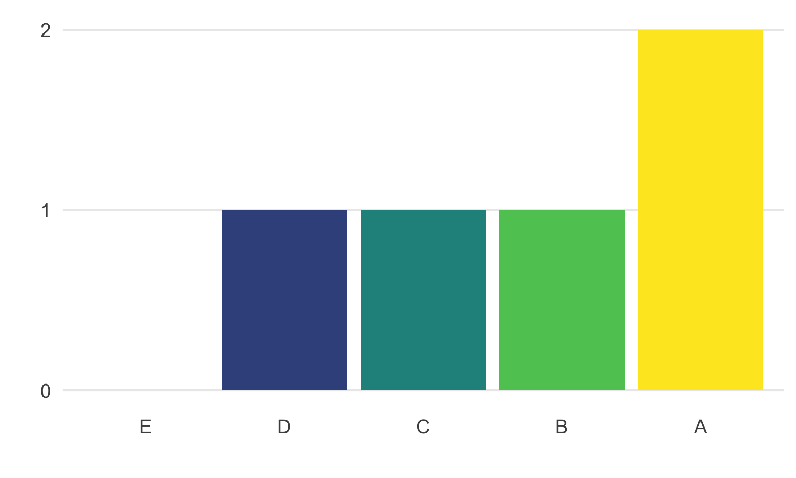

```{r setup, include = FALSE}
knitr::opts_chunk$set(
  echo = FALSE,     # don't show code chunks
  message = FALSE,  # don't show code messages
  warning = FALSE,  # don't show code warnings
  out.width = "75%" # show images at 75% page width
)
library(markr)
```

```{r, eval=F}
# set eval=T to knit this example for debugging
marks <- demo_marks   # load your data as marks
student <- marks[1, ] # selects just the first row
```

**Student**: `r student$name` (`r student$ID`)  
**Marker**: `r student$marker`  
**Grade**: `r student$grade`

You answered question `r student$question`.

## Categories

```{r, results='asis'}
cols <- list(
  "KR" = "Knowledge and Research",
  "CE" = "Critical Evaluation",
  "AC" = "Academic Communication"
)
cats <- list(
  "1" = "Needs Work",
  "2" = "Acceptable",
  "3" = "Good",
  "4" = "Outstanding"
)

category_table(student, cols, cats)
```

## Individual Feedback

`r student$feedback`

## Generic Feedback

Text to be included in every feedback file.

* You can use markdown
* To create lists

### Distribution of Marks

```{r}
# you can create plots dynamically
# mark_dist(marks, "grade", facet_by = "question", 
#           scale = c("E", "D", "C", "B", "A"))

# if the same images are used in many files 
# it is better to save them and reference like this:

```


